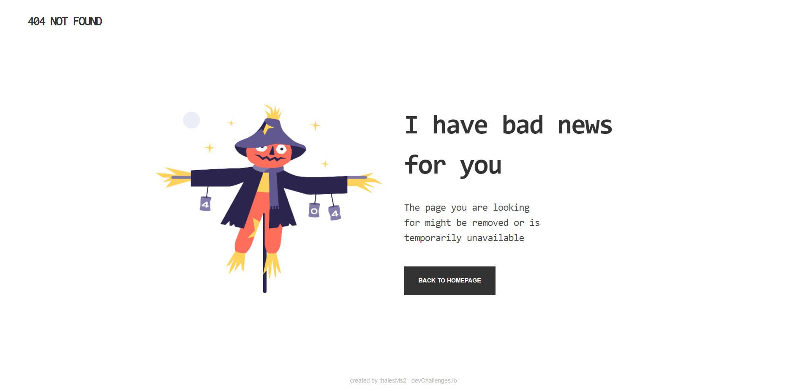

<!-- Please update value in the {}  -->

<h1 align="center">404NotFound - DevChallenges.io</h1>
> Solution for a challenge from  <a href="http://devchallenges.io" target="_blank">Devchallenges.io</a>.

  <h3>
    <a href="https://thalesms2.github.io/404-not-found/">
      Solution
    </a>
     | 
    <a href="https://devchallenges.io/challenges/wBunSb7FPrIepJZAg0sY">
      Challenge
    </a>
  </h3>

